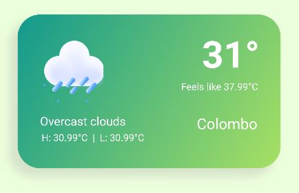

# Weather App

## Overview
A cross-platform mobile application was developed using Flutter to get the real-time weather according to the user's current location. UI is created as a card view so that the developers can use this as a card view in their applications. The app includes current temperature, lowest possible temperature, highest possible temperature, weather status and weather icon.

### Used Tools

* Flutter
* OpenWeatherMap
* Android Studio

## App View

## Getting Started

For help getting started with Flutter, view
[online documentation](https://flutter.dev/docs), which offers tutorials,
samples, guidance on mobile development, and a full API reference.   

## Author
Athindu Umayanga : [@Athindu](https://github.com/Athindu)
